# React Native Permission
## This repository is about the app based on React Native which uses React Native Permissions.

### Screenshots:

### ``` Record Audio ```
<div align="center">
  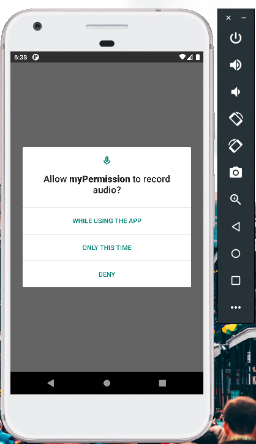
  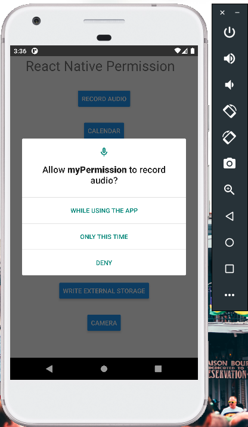
  </div>

### ``` Camera ```
<div align="center">
  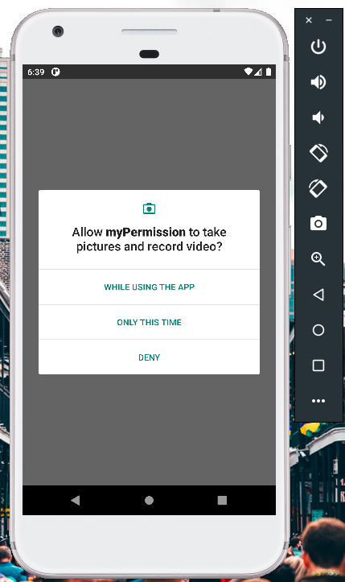
  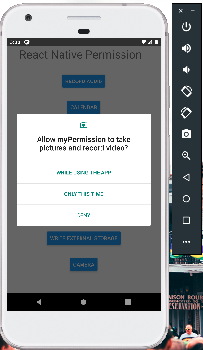
  </div>

### ``` Contact ```
<div align="center">
  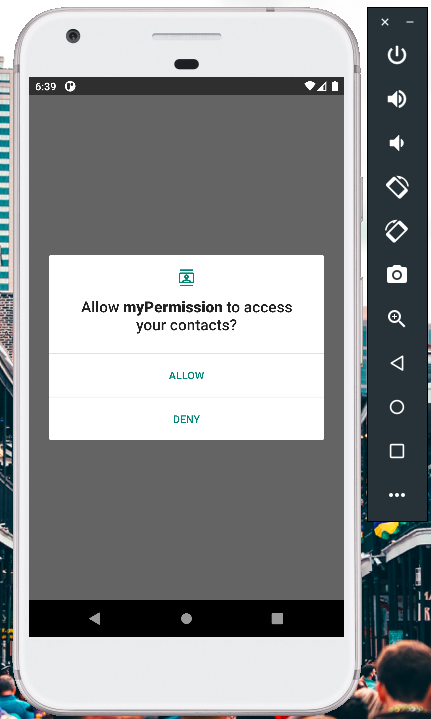
  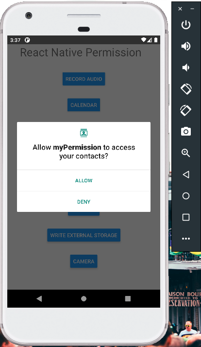
  </div>
  
### ``` Write External Storage ```
<div align="center">
  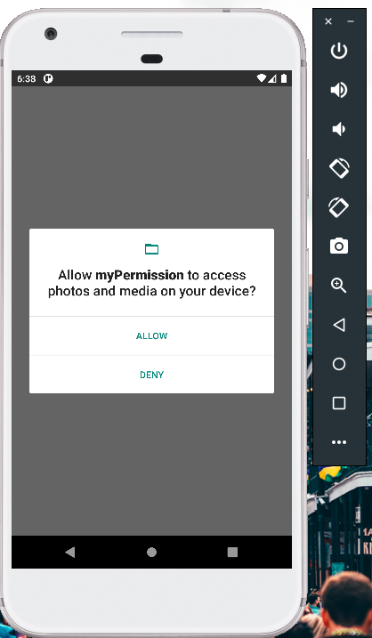
  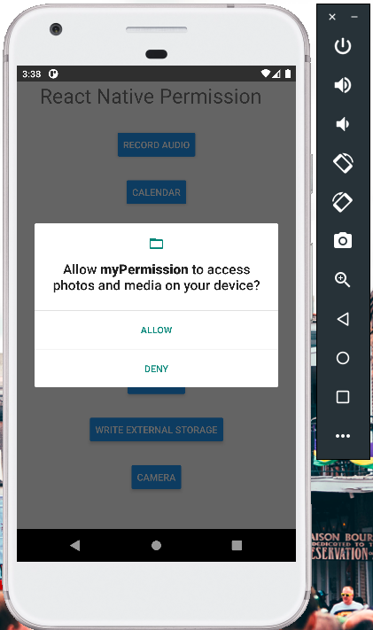
  </div>
  
### ``` Location ```
<div align="center">
  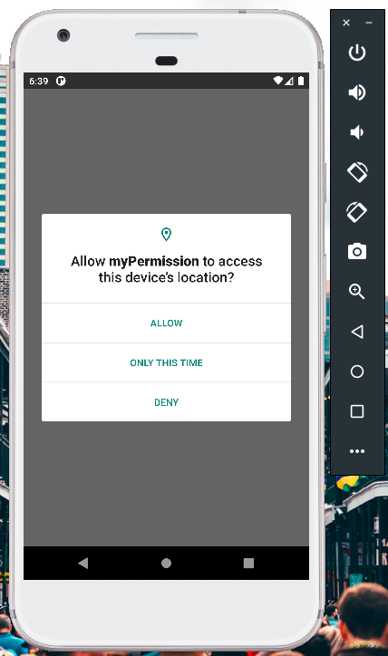
  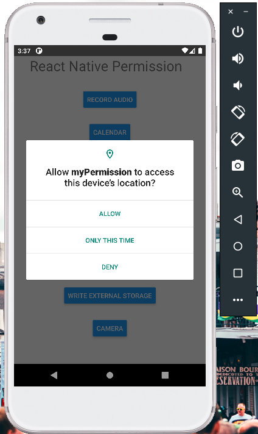
  </div>
  
### ``` Call ```
<div align="center">
  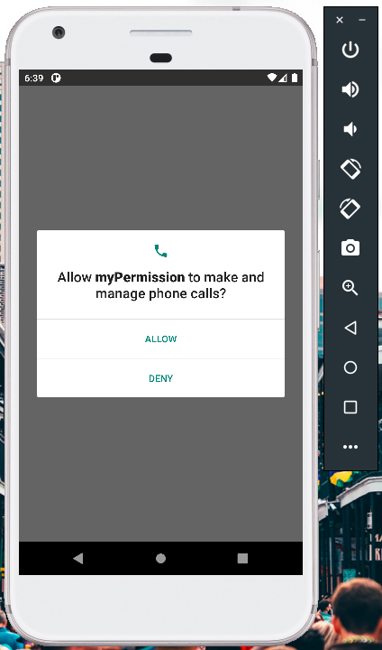
  
  </div>
  
### ``` Send SMS ```
<div align="center">
  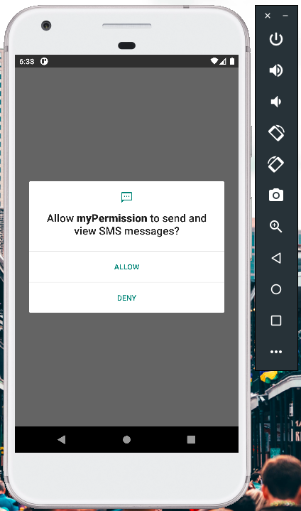
  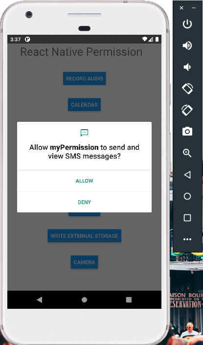
  </div>
  
### ``` Calendar ```
<div align="center">
  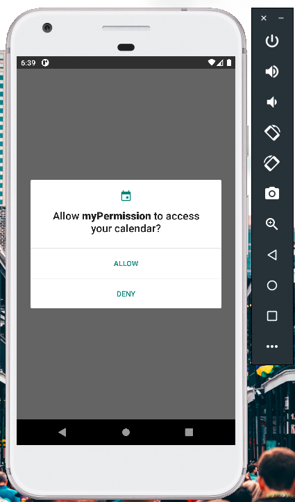
  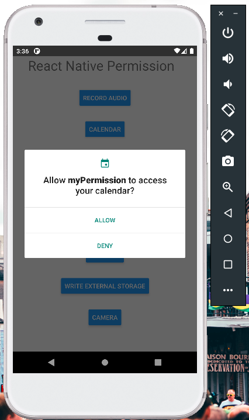
  </div>
